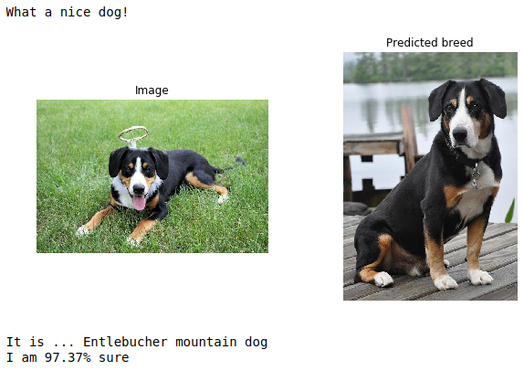

# Dog Breed Classifier

I created this neural network so anyone can supply an image of a dog to figure out its breed. A fun feature is that you can upload a face pic and you will get the dog breed that you look like.

### Overview

I use pre-trained detectors of dogs and human faces. Then I create a CNN to identify a dog breed. I build a one from scratch, then I build another one using transfer learning.

The final algorithm makes predictions with 87% accuracy.

### Methods

* CNN (Convolutional Neural Network)

### Tech

* Python
* PyTorch
* OpenCV
* Matplotlib
* NumPy

### How to use

To take a look at the notebook, just click on `dog_breeds.ipynb` and it should open automatically.

Alternatively you can download the project and open the file `dog_breeds.html` in your browser to see the results.

## Dataset

Datasets were supplied by Udacity. They contain images of known people and various dogs.

#### Size

One dataset contains images of 5749 people and 1, sometimes a few pictures per person.
The other one contains about 60-100 dog pictures per each of 133 breeds.
